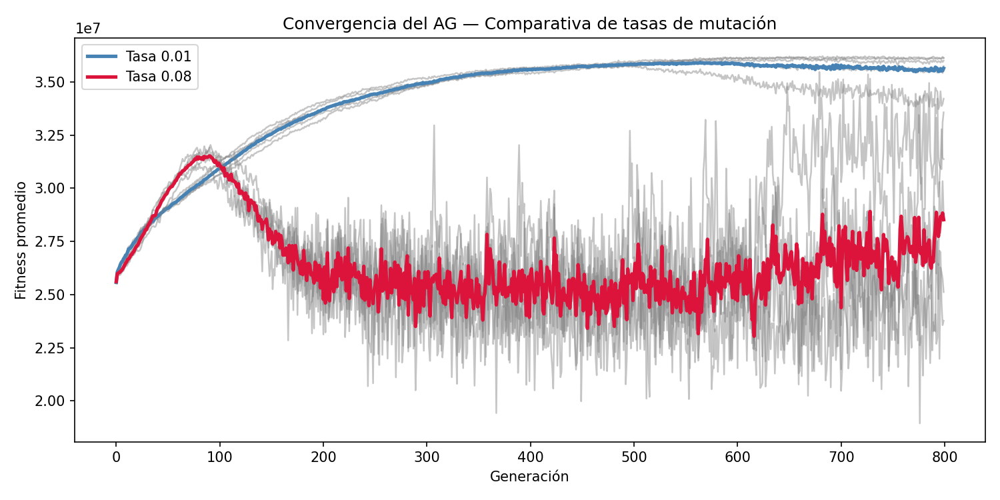

**Alumno:**
Ángel Roberto Rodríguez Miranda.

**Actividad:**
Evaluación ordinaria (Proyecto de investigación)

**Materia:**
Algoritmos genéticos y evolutivos.

**Docente:**
Sebastián González Zepeda.

**Universidad de Colima.
Ingeniería en computación inteligente.**

**Presentación del problema.**
Se busca implementar un algoritmo genético para la optimización en la
asignación de recursos a los municipios de la zona occidente del país en
función de su vulnerabilidad y peligro a los riesgos. Específicamente
MXN \$10,000,000.00 entre 267 municipios. Los datos son proporcionados
en un archivo .csv, que contienen los siguientes datos:

estado: Posibles estados son Nayarit, Jalisco, Colima y Michoacán.
Municipio: 267 municipios diferentes (Es el identificador)
zona_sismica_CFE: donde A es riesgo más bajo, hasta D riesgo más alto.
grado_peligro_inundacion_CENAPRED: los posibles valores son Muy bajo,
bajo, medio, alto y Muy alto.
grado_vulnerabilidad_social_CENAPRED: los posibles valores son Muy bajo,
bajo, medio, alto y Muy alto.
tiene_ARM: Sí o No.

**Diseño del AG.**
Para el diseño del algoritmo se tomó la decisión de tomar los datos del
.csv y guardarlos en un dataframe con la librería pandas, posteriormente
convertir los datos de texto a números y boleanos, los nombres del
estado y municipio se dejaron en formato texto.

**Cromosomas.** 
Para la representación de los cromosomas se optó por
representar a cada municipio como un gen del cromosoma, donde el valor
sería el presupuesto que será destinado a ese municipio, por ejemplo, un
cromosoma podría ser el siguiente: \[20000.09, 1500.50, 234.54, 5.05,
... y así hasta completar los 267 genes\].

**Pesos.**
Se decidió asignar el menor peso a la falta de ARM, con un valor de 10,
ya que se considera el menor peligro para la población, aunque
representa una desatención por parte del estado.

La vulnerabilidad social se dejó como el segundo riesgo más bajo, con un
peso de 25. Sin embargo, su valor no está muy por debajo de los
parámetros de mayor prioridad, por lo que sigue siendo importante
destinar recursos a comunidades con menor capacidad de reacción ante
desastres naturales para evitar consecuencias a largo plazo.

El riesgo de sismo tiene el segundo peso más alto, con un valor de 30,
debido a que, aunque son más frecuentes en la zona Occidente del país,
los eventos sísmicos que generan grandes estragos económicos son menos
comunes en comparación con las inundaciones. Aun así, los sismos fuertes
pueden causar daños en infraestructura cuyas reparaciones pueden tardar
décadas.

Finalmente, el riesgo por inundación recibió el mayor peso, con un valor
de 35. De acuerdo con el Instituto Belisario Domínguez (2018), las
inundaciones constituyen el desastre natural más frecuente en México.
Cabe resaltar que este fenómeno afecta actividades económicas primarias,
que a su vez repercuten en otros sectores, por lo que mitigar sus
consecuencias es esencial para los municipios.

**Población.**
La población inicial es de 150 individuos, primeramente, se consideró
iniciar con 100, pero al ser 267 y haber infinitas combinaciones
posibles se decidió ampliar un poco más el rango para tener más
posibilidad de encontrar soluciones que tiendan al optimo en las
poblaciones iniciales, pero tomando en cuenta también la capacidad de
computo disponible. Se debe tomar en cuenta el factor de las épocas, ya
que se puede compensar un tamaño chico de población con mayor número de
épocas, en este caso se decidió usar 800 epocas para una exploración
total de 120,000 candidatos.

**Fitness.**
Se agregó una columna en el dataframe la cual se llama "prioridad" que
hace un cálculo de la prioridad de cada municipio haciendo un cálculo
tomando en cuenta los 4 ultimos valores del dataframe original, la
ecuación que calcula la prioridad es la siguiente: Para el municipio ,
la prioridad se define como:

Donde:
--- zona sísmica CFE del municipio , escalada de 1 (zona A) a 4 (zona D)
--- grado de peligro por inundación CENAPRED, escalado de 1 (Muy bajo) a
5 (Muy alto)
--- grado de vulnerabilidad social CENAPRED, escalado de 1 (Muy bajo) a
5 (Muy alto)
--- indicador de presencia de Atlas de Riesgos Municipal (ARM); si el
municipio cuenta con ARM, en caso contrario

La ecuación "fitness = suma(presupuesto_municipio\[i\] \*
prioridad\[i\]) -- penalización" para cada municipio i, recompensa la
asignación de mayores recursos a municipios con mayor prioridad. Cuando
la solución sobrepasa el límite de presupuesto se penaliza con
"penalización = (exceso*max(prioridades))*2" donde prioridades es un
arreglo con las prioridades. Cuando no se sobrepasa el límite entonces
la penalización se hace por acumulación de recursos. Definido como:
penalización = suma(presupuesto_municipio\[i\] --
límite_m)\*max(prioridades).

Límite_m se define como: presupuesto_total\*0.03 (3% del presupuesto
total).

**Selección.**
Se usa un k=5 para conservar diversidad, compensando un poco la poca
diversidad inicial, pero suficiente para que no se elijan individuos
poco aptos.

**Cruzamiento y mutación.**
Usamos cruzamiento uniforme para seguir promoviendo la diversidad.

Se usa mutación uniforme adaptativa para representación real, donde cada
gen tiene una probabilidad de mutación y se modifica mediante un valor
aleatorio proporcional al valor actual del gen, permitiendo aumentar o
disminuir la asignación de recursos sin generar valores negativos. Se
usaron dos tasas de mutación para comparar mejor resultado entre ambas,
cada una con 5 corridas. Las tasas son las siguientes:

1% de mutación: Ya que los demás parámetros del AG promueven diversidad,
la primera tasa es conservadora para hacer un balance.
8% de mutación: Aunque los demás parámetros promueven diversidad, se
sospecha que esta diversidad no es suficiente para el rango posible de
búsqueda.

**Resultados.**
Para poner en contexto los resultados debemos dar un poco de contexto,
la siguiente tabla muestra el municipio con mayor prioridad evaluado con
la formula:

figura 1.

Con este contexto ahora tiene sentido comparar los mejores resultados de
las 5 corridas de ambas tasas de mutación seleccionadas, que en nuestro
caso fueron 0.01 y 0.08.

Cabe aclarar que en ambos casos el presupuesto utilizado es de
exactamente MXN \$10M, ya que los datos están normalizados para que la
suma de los genes de cada cromosoma siempre de 1.

Mutación 0.01.

El mejor fitness obtenido fue de 37,447,528.82, el cual se calculó con
la formula anteriormente mencionada en la sección "Fitness".

figura 2.

Mutación 0.08.

El mejor fitness obtenido fue de 39,525,485.22, el cual se calculó con
la formula anteriormente mencionada en la sección "Fitness".

figura 3.

Podemos notar que el fitness obtenido con la tasa de mutación 0.08 es
mayor que con 0.01 en un 13.93%, y que de hecho en ambos casos de el
municipio con más presupuesto es el que mayor prioridad tiene (Aquila).
Aunque algo a notar es que ambas tasas de mutación dieron un menor
presupuesto a municipios con prioridad relativamente alta. En el caso de
0.01 no se le da presupuesto a 2 municipios y en el caso de 0.08 a más
de 20.

Gráfica comparativa.

Figura 4.

En la gráfica comparativa se observa que algo extraño sucede con una
tasa de mutación de 0.08, al parecer los valores que arroja por
generación fluctúan mucho, ya que más genes mutan, aunque con la función
fitness actual da un "mejor resultado final", aunque analizando el
resultado parece ser que el resultado más coherente lo da la tasa 0.01.
Las líneas grises con los resultados de cada una de las 5 corridas
respectivamente y las líneas de color sus promedios.

Conclusiones.

Comparación.

Como podemos notar con las figuras del documento y como se mencionó
brevemente, la tasa de mutación 0.08 fue superior a la 0.01, respecto a
la función de fitness actual, aunque la tasa 0.01 arroja resultados más
coherentes, esto parece que se debe a que la función de fitness premia
dar mayor presupuesto a un solo municipio. En análisis posterior a la
implementación podemos deducir que se deben implementar ambas
penalizaciones a la par

Limitaciones.

La limitación principal del algoritmo fue la función fitness, ya que al
ser una función lineal premiaba otorgar mayores recursos al municipio
prioritario, como se pudo ver en el caso de la tasa 0.08, donde al
municipio de Aquila (el de mayor prioridad) le otorgó cerca del 87% del
presupuesto. Aunque este problema se puede solucionar integrando una
tasa de penalización a la acumulación de todo el presupuesto en un solo
municipio que se aplique en todos los casos, a diferencia del algoritmo
implementado que solo se aplica en los casos que no se excede el
presupuesto.

Utilidad.

La utilidad de un algoritmo genético en este problema ya demostró su
potencial, ya que con un equipo de computo relativamente débil, se pudo
encontrar de forma fácil el municipio con mayor prioridad, y en el mismo
caso el municipio que se eligió como menos prioritario está cerca de
serlo.

Aunque todo el potencial no se pudo demostrar ya que al ser un proyecto
escolar no se cuentan con recursos suficientes para crear una solución
que se pueda poner en marcha realmente.

Cuando se crea un algoritmo como este se debe poner especial atención en
las variables que se van a tomar en cuenta para crear la ecuación con la
que se hará la toma de decisión de la prioridad de cada municipio,
también el peso que cada una de estas variables dentro de la ecuación.
Es prioritario crear una función fitness que penalice acumulación en un
solo municipio que se aplique en todas las generaciones, no solo las que
no exceden presupuesto.

Enlace a Repositorio GitHub.

https://github.com/Angel-Rodriguez16/AG_Recursos_Municipios.git

Referencias Bibliográficas.

Instituto Belisario Domínguez. (2018, 13 de enero). Inundaciones,
desastre natural más frecuente en México: IBD. Quadratín México.
https://jalisco.quadratin.com.mx/principal/inundaciones-desastre-natural-mas-frecuente-mexico-ibd/

Bibliografía.

Goldberg, D. E. (1989). Genetic Algorithms in Search, Optimization &
Machine Learning. Addison-Wesley.

CENAPRED. (2019). Identificación de peligro sísmico a nivel municipal.
https://www1.cenapred.unam.mx/DIR_INVESTIGACION/2021/1er_Trimestre/FRACCION_XLI/RS/210420_Informe_RS_CaracteristicasCFE2015.pdf
